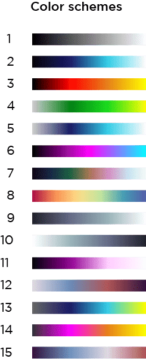

# Fluid Simulation

This code is based on Jos Stam’s paper “Real-Time Fluid Dynamics for Games”. This publication presents an easy and quick implementation of a fluid dynamics solver for game engines. The algorithms are based on the Navier-Stokes equations, which are the physical equations of fluid flow.


## Instructions:

`Language: Python 3.8.2`

### Libraries used
```
numpy: pip install numpy
matplotlib: pip install matplotlib
ffmpeg: pip install ffmpeg

```

In order to use ffmpeg you need to also install the program on your computer. Here are the [instructions](https://www.wikihow.com/Install-FFmpeg-on-Windows) to install it on Windows. 


### Usage

To run this project you need to follow the next steps:

1. Open a terminal and go to the root directory where you added the folder.
2. Type to run

```
python fluid.py
```

3. Then, the program will ask you to introduce the name of the file that has all the settings of the fluids. The default txt added to the folder is called `settings.txt`, so you can introduce this file or create a new one. It is important to add the extension of the file, which is `.txt`

Now, depending on the number of frames you've defined, will be the time the simulation will take. Once it is finished it will save a video on the same folder called [movie.mp4](movie.mp4)


### Input

This program needs a txt file. This is the correct format to create it:

At the first line, you will write the `Number of frames` you want in the simulation (30 frames equals one second). Then, on the second line, you will introduce the `Number of emitters` you want to have. Starting from the third line, you will introduce the emitter's settings. Each emitter settings should be on a different line. Values required for each one: 
- [Behavior](#behaviors) (string)
- X position (int)
- Y position (int)
- Density (int)
- X velocity (int)
- Y velocity (int)
- Emitter size (int)
- Factor movement (float)

Once you've finished adding the configuration of the emitter, you will finally add the `Color Scheme`. Each color is identified with a number. This must be a value between 1 and 15. Those are the following colors you can select.




The correct format to give its configuration is the following one: 

```
<frames>
<n-emitters>
<behavior_name> <X position> <Y position> <density> <X velocity> <Y velocity> <emitter size> <factor movement>
.
.
.
<behavior_name> <X position> <Y position> <density> <X velocity> <Y velocity> <emitter size> <factor movement>
<color>
```

Remember that the number of emitters added on the second line should match with the number of lines of each emitter configuration. For example, if you added 3 emitters, there must be 3 lines below the second line that corresponds to each emitter. 

[Example](settings.txt)


## Behaviors:

It is possible to have different fluid behaviors. You can choose between 4 different behaviors; "Horizontal Curly", "Vertical Curly", "Swirl" and "Constant". 

To change the behavior you have to add one of the following key-words:

```
- horizontalCurly
- verticalCurly
- swirl
- constant
```

This is how each one of them looks:

`Horizontal Curly`


`Vertical Curly`


`Swirl`


`Constant`


## References:
This code was based on this [file] (https://github.com/gcastillo56/com139-class/blob/master/Fluid_Sim/fluid.py) 